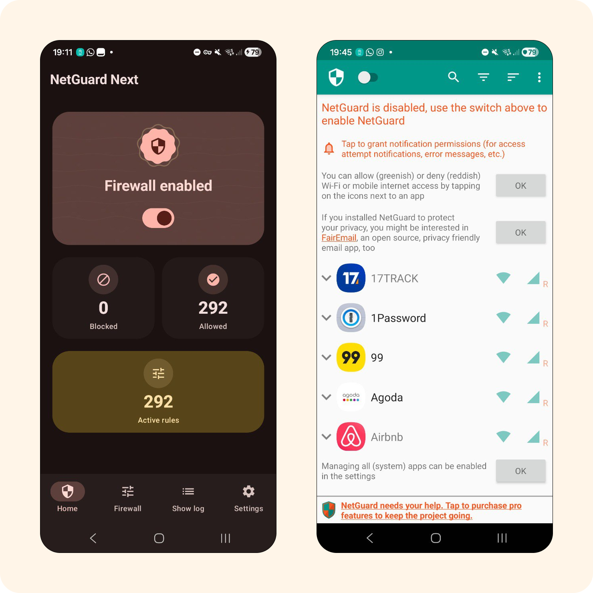
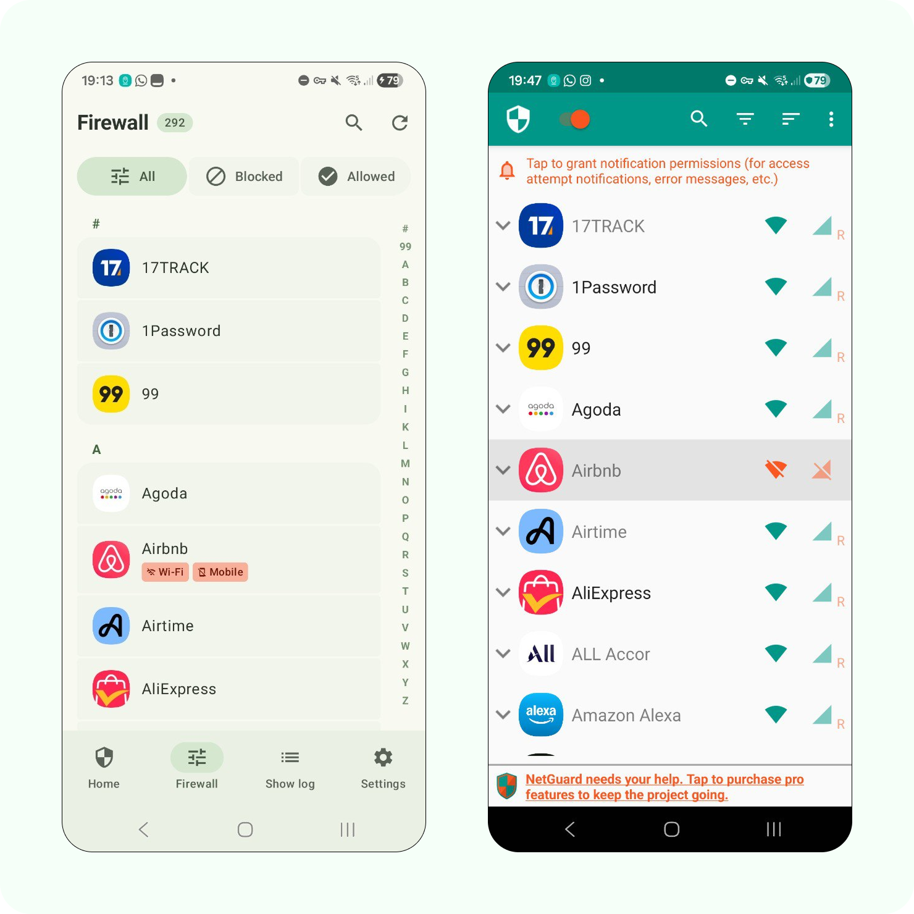
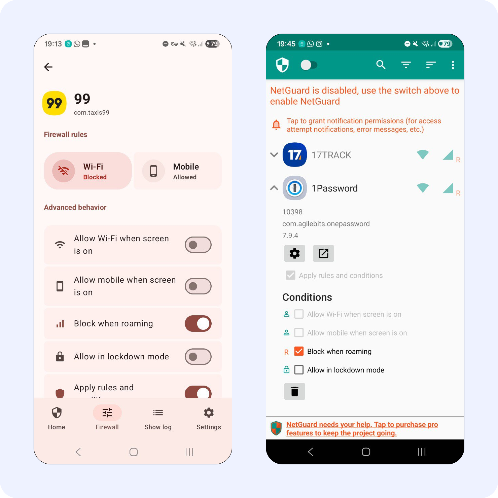
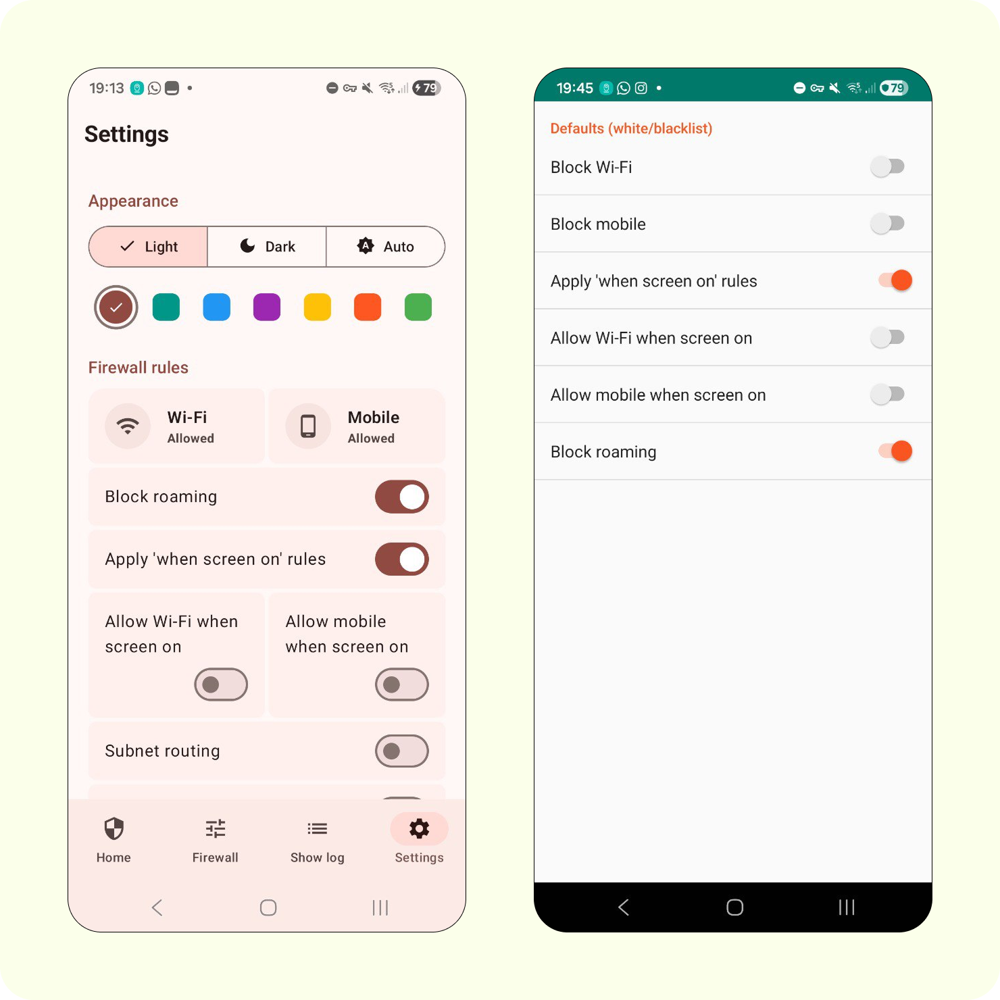

# NetGuard Next

  
  
  

No-root Android firewall with a Material 3 Expressive experience, adaptive navigation, and a redesigned traffic log.

This project is a modernized fork of the original NetGuard firewall for Android.
It keeps the no-root, VPN-based firewall model from upstream, but refreshes the app architecture and UX for current Android and Material 3 patterns.

## Screenshots

  
  
  
  

More screenshots are available in `screenshots/`.

## Upstream Reference

This fork is based on the original NetGuard project by Marcel Bokhorst (M66B):
https://github.com/M66B/NetGuard

## What Is Different In This Fork

This fork focuses on a modern UI and navigation model while keeping the core firewall behavior:

- Kotlin + Jetpack Compose UI rewrite
- Material 3 expressive styling
- Adaptive navigation (bottom bar on compact layouts, rail/suite behavior on larger layouts)
- Tablet-friendly master/detail flow for firewall rules
- Cleaner back-stack behavior across tabs
- Redesigned traffic log screen with timeline and "By app" views
- App icon support in log rows and in the app picker
- Protocol/status filters and searchable app picker
- In-app guidance to enable filtering when allowed traffic logs are needed
- Improved touch/ripple clipping consistency in settings and controls
- Modernized settings UX with clearer grouped options

### Modern UI Preview

  
  
  
  

These screens highlight this fork's updated look-and-feel.

## Core Capabilities

- No-root firewall using Android `VpnService`
- Per-app allow/block rules for Wi-Fi and mobile data
- Optional filtering mode for per-address visibility and controls
- DNS and forwarding screens
- Traffic log with protocol/status filtering
- Log retention configuration
- Open-source codebase under GPLv3

## Important Behavior Notes

- This app uses a local VPN tunnel, not a remote VPN server.
- If filtering is disabled, traffic logging may mainly show blocked attempts. Enable filtering to capture full allowed traffic context.
- Some OEM ROMs have VPN stack bugs that can affect startup or reliability.

## Project Layout

- App module: `app/`
- UI code: `app/src/main/kotlin/eu/faircode/netguard/ui/`
- Screens: `app/src/main/kotlin/eu/faircode/netguard/ui/screens/`
- Main tabs: `app/src/main/kotlin/eu/faircode/netguard/ui/main/`
- Native engine: `app/src/main/jni/netguard/`
- Resources: `app/src/main/res/`

## License

Licensed under GNU GPLv3. See `LICENSE`.
