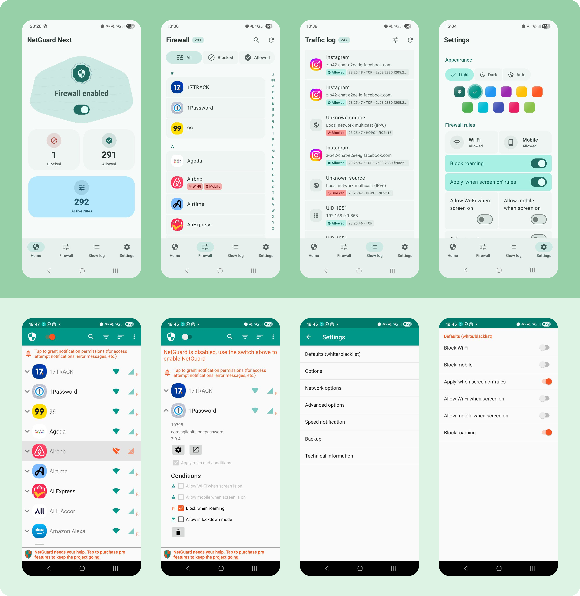
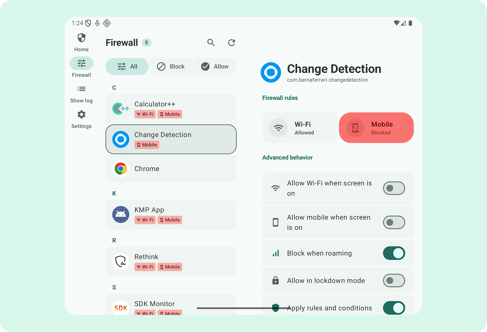

# Re-NetGuard (Compose + M3)

<p align="center">
  
</p>

<p align="center">
  <strong>Local-first, no-root firewall control with a modern Material 3 experience.</strong><br>
  Built with Kotlin 2.3, Jetpack Compose, and a first-party Android-only architecture.
</p>

<p align="center">
  <a href="https://kotlinlang.org/"></a>
  <a href="LICENSE"></a>
  <a href="#"></a>
</p>

---

Re-NetGuard is a modernized fork of the original [NetGuard](https://github.com/M66B/NetGuard) project by Marcel Bokhorst. It preserves NetGuard’s core philosophy—no-root, VPN-based filtering, local-first processing, and no account lock-in—while adding a refreshed Material 3 Expressive Android UX with improved workflows for logs, rules, and settings.

## 🚀 Key Features

- 🛡️ **No-Root by Design:** Uses Android `VpnService` with local filtering, no external proxy dependency.
- 🎨 **UI-First Redesign:** Material 3 Expressive visuals, cleaner spacing, and improved interaction behavior.
- 📱 **Modern Navigation:** Adaptive patterns tailored for both phone and tablet form factors.
- 🔒 **Safer Controls:** Clearer toggles, better feedback, and improved update-check visibility.
- 📊 **Stronger Log Clarity:** Upgraded traffic timeline views with status, protocol, and app-level context.
- 🌍 **Localization-Aware:** Translated update states and expanded language coverage.

## 📸 Screenshots



## ✨ What's New in Re-NetGuard

If you're coming from the original NetGuard, here are the major differences you'll notice:

- **Complete Visual Overhaul:** Built entirely with Jetpack Compose, the app embraces Google's Material 3 Expressive design language for a modern, fluid experience.
- **100% Kotlin Rewrite:** The entire original Java codebase has been ported and rewritten in modern Kotlin, leveraging coroutines and current Android architecture patterns.
- **Adaptive Layouts:** Tablets and foldables get a first-class two-pane layout for managing rules and seeing app details side-by-side.
- **Improved Log Clarity:** The traffic logs have been completely redesigned so it's instantly clear which connections were blocked, which were allowed, and what protocols were used.
- **Polished Settings:** We've grouped settings logically with clearer explanations and removed the clutter so the most important controls are easy to find.
- **Simplified Experience:** The focus is on a streamlined core firewall experience. We haven't ported every obscure legacy and experimental feature from the original; instead we focused on stability, performance, and UI excellence for the features people use most.

## ⚙️ How It Works

Re-NetGuard operates as a local-only application. It uses Android's built-in `VpnService` to route your device's traffic through a local sinkhole. 

Because the app routes the traffic *internally on your device*, **it never sends your data to an external proxy or remote server**. The application can inspect the outbound connection attempts and selectively drop or allow packets based on the rules you set for each app, providing a true on-device firewall without requiring root access.

## 📱 Adaptive Layouts

Re-NetGuard dynamically scales to take advantage of larger screens, offering a dedicated two-pane layout for comfortable viewing on tablets and foldables.

<p align="center">
  
</p>

## 🏁 Getting Started

### Prerequisites

- **JDK 17** or higher.
- **Android Studio** (current stable) with the Android SDK (API 26+ target).

### Build & Run

#### Android
```bash
./gradlew :app:assembleDebug
./gradlew :app:installDebug
```

You can also build a release variant configured for production checks and shrinker behavior by running `./gradlew :app:assembleRelease`.

## ⚠️ Behavior Notes

- This app is local-first and does not proxy traffic through a third-party backend.
- Some device manufacturers apply stricter VPN policies; behavior can vary.
- Certain background/network capabilities depend on notification, battery optimization, and device permissions.

## 📜 Credits & License

- **Original Project:** [NetGuard](https://github.com/M66B/NetGuard) by Marcel Bokhorst.
- **License:** GNU GPLv3. See [LICENSE](LICENSE) for details.

<p align="center">
  
</p>

---
<p align="center">Made with ❤️ using Jetpack Compose</p>
